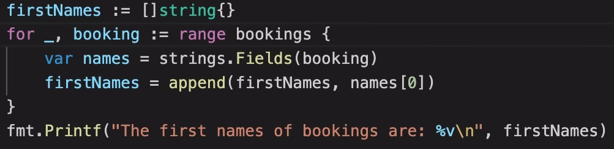

# Go-Lang-Cheats

Personal progress tracker and cheat sheet for the Go programming language.

---

## Table of Contents

1. [Progress Checklist](#progress-checklist)
2. [Personal Notes](#personal-notes)
3. [Configuration](#configuration)
4. [Usage & Snippets](#usage--snippets)
5. [License](#license)

---

## Progress Checklist

Track your learning with a simple checklist:

- [ ] **Basics** (syntax, variables, types)

---

## Personal Notes

Use this section to jot down your observations, tips, or any custom reminders as you progress:

<details>
<summary>Basic</summary>

- fmt is formatter  
- println auto-creates the new line  
- printf for using with vars  
- <code>:=</code> sugar syntax can be used for assigning vars directly (but not const)  
- defining int types explicitly for robust code  
- the data type should be in same format when performing any  

</details>

<details>
<summary>Mid</summary>

- Arrays require fixed size; not flexible for unknown lengths  
```go
var someThing [50]string
someThing[0] = var1 + "" + var2
```
- Slices are dynamic arrays; no fixed size needed  
```go
var someThing []string
someThing = append(someThing, "value")
```
- Blank identifier "_" when we want to ignore something or when we expect a value, that we dont need  



</details>

---

## Configuration

```bash
go mod init go-lang-cheats
```

---

## Usage & Snippets

### Hello World

```go
package main

import "fmt"

func main() {
    fmt.Println("Hello, Go-Lang-Cheats!")
}
```

---

## License

Distributed under the MIT License. See [LICENSE](LICENSE) for details.